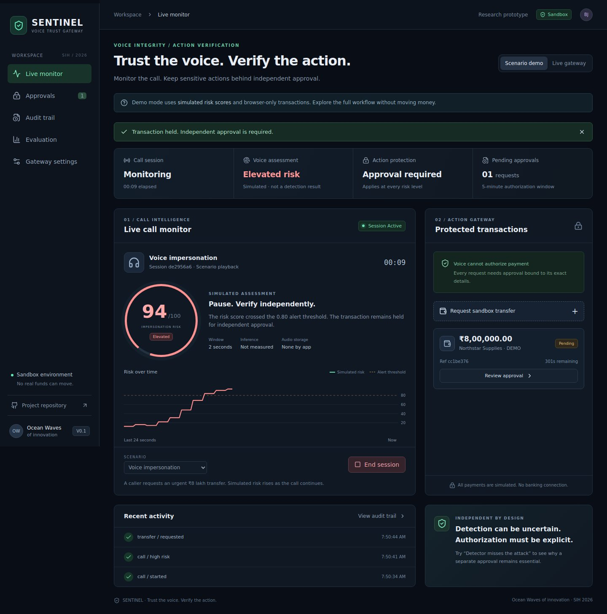

# SENTINEL

### Voice integrity. Independent action verification.

SENTINEL is an SIH research prototype for a finance desk facing voice impersonation: assess the call, then require independent approval before a sensitive transaction can proceed.

**Prototype:** Deployment configuration is ready. Vercel account access is blocking publication; a verified live URL has not yet been issued. Meanwhile, [watch the recorded working demo](demo/walkthrough.webm) or run locally. See [deployment status](docs/DEPLOYMENT.md#deployment-connection-status).

[Run locally](#run-locally) · [Watch recorded demo](demo/walkthrough.webm) · [Demo walkthrough](demo/README.md) · [Architecture](docs/ARCHITECTURE.md) · [Model card](docs/MODEL_CARD.md) · [Evaluation](evaluation/README.md)

> **Research prototype.** All payments are sandbox records. Scenario mode uses explicitly simulated risk scores. Real audio mode requires the backend and an optional trained model. No detection-accuracy or production-readiness claim is made.



## The problem we demonstrate

An accounts employee hears a familiar voice asking for an urgent **₹8 lakh transfer**. Voice familiarity is not sufficient authorization. SENTINEL presents audio risk as an advisory signal and binds a separate approval to the exact transaction amount and beneficiary.

Even if a detector misses an attack, the backend still requires independent authorization. That requirement is the central workflow demonstrated here.

## What works

| Capability | Status |
|---|---|
| Responsive React monitoring console | Implemented |
| Three isolated browser scenario demonstrations | Implemented; simulated scores |
| Microphone and audio-file streaming | Implemented; Python backend required |
| Two-second window, silence gate, EWMA | Implemented; thresholds not calibrated |
| Optional pinned Wav2Vec2 baseline | Integrated; third-party, local CPU inference |
| ONNX probability-model adapter | Implemented; compatible checkpoint required |
| Operator / independent approver separation | Backend-enforced with separate credentials |
| Exact transaction binding, expiry, single-use execution | Implemented and tested |
| SQLite audit history and hash-chain check | Implemented; not immutable storage |
| Automated API and browser workflow tests | Included |
| Vercel frontend configuration | Included |
| Custom distilled INT8 student / codec training | Future research |
| Held-out speech accuracy / Indian-language validation | Not yet evaluated |
| SIP/PSTN and real banking integrations | Not implemented |

## Try the demonstration

1. Start **Voice impersonation** in Scenario demo mode.
2. Observe the explicitly simulated risk rise.
3. Request a sandbox transfer. It remains pending.
4. Open **Approvals** and confirm or reject the exact details.
5. Execute an approved sandbox transfer once, then inspect **Audit trail**.
6. Repeat with **Detector misses the attack**. Approval is still required.

Scenario state stays in the current tab and resets on refresh. It does not test the real detector or server security. For actual role separation, use the live backend and different operator/approver browser sessions.

## Run locally

Requires Node.js 22+ and Python 3.12. Commands below run from the repository root.

### Frontend-only demonstration

```bash
npm --prefix frontend ci
npm --prefix frontend run dev
```

Open the local address printed by Vite. No keys or model are needed for the clearly labelled scenario mode.

### Full backend and frontend

```bash
python -m venv .venv
# macOS/Linux:
source .venv/bin/activate
# Windows PowerShell: .venv\Scripts\Activate.ps1
pip install -r backend/requirements.txt
python scripts/init_env.py
npm --prefix frontend ci
npm --prefix frontend run build
uvicorn sentinel.app:app --app-dir backend --env-file .env --host 127.0.0.1 --port 8000 --ws-max-size 32768
```

Open http://localhost:8000. Choose **Live gateway**, leave its URL blank and enter the operator credential from your local `.env`. Keep this file private. Open a separate browser/device using the approver credential to review transactions. API documentation: http://localhost:8000/docs.

Without a model, live audio correctly reports **Model unavailable**, never a fake assessment. To enable the optional pretrained baseline, follow [ml/README.md](ml/README.md). The model's dataset disclosure is incomplete; see [limitations](docs/MODEL_CARD.md).

Docker alternative, after generating `.env`:

```bash
docker compose up --build
```

## Verification

```bash
pip install -r backend/requirements-dev.txt
# macOS/Linux:
PYTHONPATH=backend pytest backend/tests -q
# PowerShell: $env:PYTHONPATH="backend"; pytest backend/tests -q
npm --prefix frontend test
npm --prefix frontend run build
cd frontend
npx playwright install chromium
npm run test:e2e
```

Tests cover authorization roles, detail tampering, expiry, replay, simultaneous execution, audit modification, invalid PCM, absent/failed models, the browser approval journey and mobile overflow. CI runs the same checks.

## Model evidence

The optional third-party baseline is `mo-thecreator/Deepfake-audio-detection`, pinned to revision `e4d9874b493362149cec96ced85f00b00b1a04c0`. It is **not** a custom SENTINEL-V0 or an INT8 student.

The committed [compute benchmark](evaluation/benchmark.json) measures preprocessing plus model execution on a synthetic tone, not speech accuracy. It includes hardware/runtime context and does not support a sub-10 ms claim. [Speech evaluation tooling](evaluation/README.md) is provided; no independently validated accuracy result is published.

## Repository map

| Path | Purpose |
|---|---|
| `frontend/` | React console, scenario logic, audio worklet, browser tests |
| `backend/` | FastAPI APIs, audio processing, authorization, SQLite audit, tests |
| `ml/` | Pinned baseline download and model setup |
| `evaluation/` | Clip metrics, compute benchmark and manifest template |
| `docs/` | Architecture, model card, API, threat model, deployment |
| `demo/` | Reproducible presentation walkthrough |
| `scripts/` | Private environment initialization |
| `.github/workflows/` | Automated verification |

## Deployment and scope

Vercel serves the frontend from this same repository using root `vercel.json`. Live mode connects to a separately run Python service with persistent storage. See [deployment instructions](docs/DEPLOYMENT.md).

The backend is a single-workspace research prototype. Do not expose shared credentials to public demo visitors. Audio is not recorded by the application, but this is not a guarantee about operating-system memory, infrastructure logging, or regulatory compliance. Hash-linked events are not blockchain or immutable evidence. See [threat model](docs/THREAT_MODEL.md) and [security policy](SECURITY.md).

## Team and attribution

**Ocean Waves of innovation · SIH 2026**

Project owner: [Bhuvaneshj-dev](https://github.com/Bhuvaneshj-dev). Original application work in this repository covers streaming orchestration, the console, sandbox authorization and audit/evaluation integration. Pretrained model architecture and weights belong to their upstream authors; do not describe them as original trained SENTINEL weights.

Application code uses the existing [MIT license](LICENSE). The optional model is declared Apache-2.0 upstream and has separate provenance and dataset limitations. React, FastAPI, PyTorch, Transformers, ONNX Runtime and Lucide retain their respective licenses.
