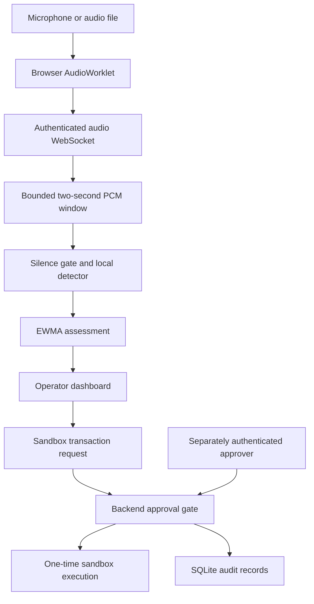

# Architecture

## Frontend

React + Vite. Scenario mode is fully browser-local, explicitly simulated, and resets on reload. No microphone is opened in scenario mode. Separate visitors have separate memory and cannot see each other's demo transactions. Live mode connects to a configured backend with operator/approver credentials stored only in tab memory.

Microphone/file audio uses a 16 kHz AudioContext, mono mixing, and 200 ms float32 PCM blocks. File input is limited to 25 MB and three minutes. Uploaded files are decoded in browser memory and played through the processing graph in real time, without audible loopback. No raw audio upload is stored by the application.

## Backend

FastAPI + WebSockets. Authentication is the first WebSocket message, not a URL query parameter. Two-second windows, 200 ms minimum hop, bounded buffer, finite PCM validation and eight concurrent stream slots. Inference runs in a worker thread. Messages are paced; raw samples remain in process memory and are released when overwritten or the session ends. Python memory release is not guaranteed secure erasure.

## Transactions

SQLite write transactions use `BEGIN IMMEDIATE` to serialize authorization/execution. Amounts use integer paise. The approval digest binds UUID, call ID, beneficiary and amount. No API changes those details. An operator cannot approve. An approver cannot execute. Approval expires five minutes after request and can execute once. Actual payment networks are not connected.

## Audit

Application events form a SHA-256 linked chain. This detects inconsistent edits when the chain is verified. An attacker with full database write access can recompute or truncate the chain; this is not immutable storage, blockchain, or nonrepudiation. Production would require external anchoring and authenticated individual identities.

## Hosting

Vercel hosts the static console. The provided Python backend is designed for a persistent process and SQLite volume. It can serve the built console locally or be reached over HTTPS/WSS from Vercel. This release does not deploy the Python database/inference service as Vercel Functions.
